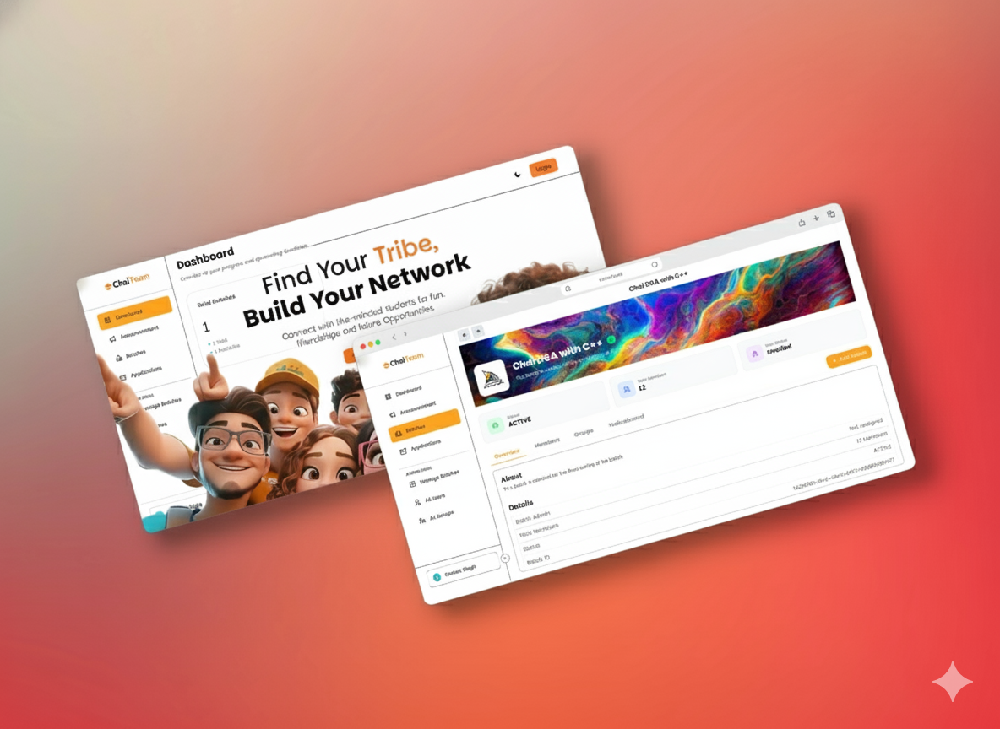
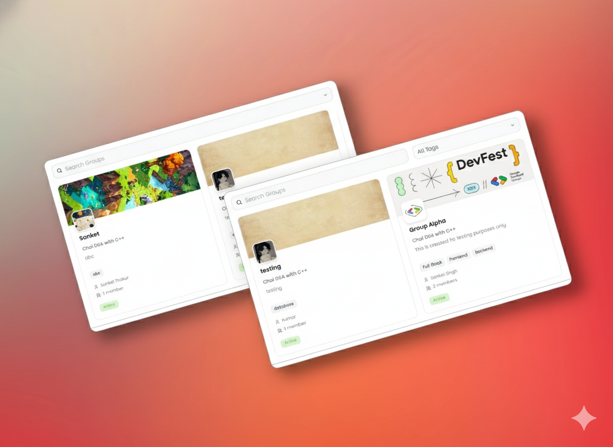

# ChaiTeam 🎓

  
  
  **Enhance Your Coding Skills Today!**
  
  
  
  

## 📖 About

ChaiTeam is a collaborative web project built for **Chaicode cohort** to streamline team coordination, task management, and knowledge sharing. Our mission is to create a lightweight but powerful platform where every team member can:

- **Communicate**: Share updates, chat, and centralize discussions.
- **Organize**: Create, assign, and track tasks with clear visibility.
- **Share Knowledge**: Post guides, snippets, and resources so everyone learns from each other.
- **Grow Together**: Give and receive feedback, track progress, and improve over time.

We designed ChaiTeam with simplicity and flexibility in mind — it's intuitive enough for newcomers, but modular enough to support more advanced workflows as our team matures.

## [Visit ChaiTeam](https://www.chaiteam.in/)

  
  
  

## Features

**👥 Team Creation & Collaboration** – Create teams, invite members, and collaborate seamlessly

**📚 Group Knowledge Hub** – Share resources, guides, and important updates within your team

**📅 Activity Timeline** – View team updates, announcements, and recent activity in one place

**🏆 Member Roles & Permissions** – Manage leaders, moderators, and contributors with role-based access

**🌙 Light & Dark Mode** – Switch themes for a personalized and comfortable workspace

**🔐 Secure Authenticatio**n – Protect accounts with secure login and role-based safeguards

## How to Use

1. To access the platform you should be an part of any **Cohort** of the **ChaiCode**.
2. Login on the platform using the same **Email** which you used to **purchase or register** in the Cohort.
3. You will be automatically in the batch related to your Cohort.
4. Explore new groups and join suitable groups or Lead your own group.
5. Make new friends and do not break the rules of the platform.

## Support

For questions, issues, or suggestions:

- Open an issue on GitHub
- Check existing issues before creating new ones
- Provide detailed information for bug reports

## Built By

Two developers are joned together to create this project.

### Developer 1: Kumar Nirupam

**Twitter (X)** : [@KumarNirupam1](https://x.com/KumarNirupam1)  
**Linkedin** : [@Kumar Nirupam](https://www.linkedin.com/in/kumarnirupam/)  
**GiiHub** : [@KUMARNiru007](https://github.com/KUMARNiru007)

### Developer 2: Sanket Singh

**Twitter (X)** : [@SinghSanket78](https://x.com/SinghSanket78)  
**Linkedin** : [@Sanket Singh](https://www.linkedin.com/in/sanket-singh-5359732b8/)  
**GiiHub** : [@sanketsingh01](https://github.com/sanketsingh01)

If you like this project, consider giving it a ⭐️ on GitHub and sharing it with others!

> _**Happy coding!**_
